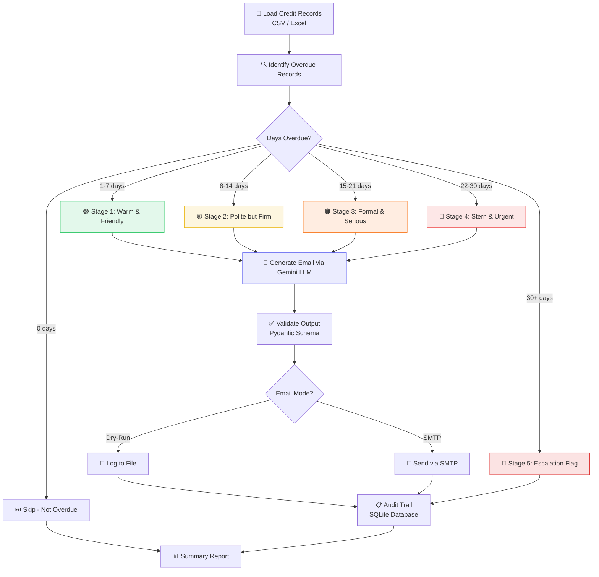

# 💰 Finance Credit Follow-Up Email Agent

> **AI Enablement Internship — Task 2**  
> An AI agent prototype that automatically generates and manages follow-up emails for pending credit/invoice payments with progressive tone escalation.


---

## 📋 Table of Contents

1. [Project Overview](#project-overview)
2. [Architecture](#architecture)
3. [Agent Flow Diagram](#agent-flow-diagram)
4. [Core Features](#core-features)
5. [Tech Stack & Rationale](#tech-stack--rationale)
6. [Setup Instructions](#setup-instructions)
7. [Usage](#usage)
8. [Tone Escalation Matrix](#tone-escalation-matrix)
9. [Sample Output](#sample-output)
10. [Prompt Design](#prompt-design)
11. [Security Mitigations](#security-mitigations)
12. [Project Structure](#project-structure)

---

## 📖 Project Overview

### Business Problem

Finance teams spend significant time chasing overdue payments. Manual follow-ups are:
- **Inconsistent** in tone and timing
- **Error-prone** — wrong amounts, missed invoices
- **Unscalable** — hundreds of invoices per cycle
- **Poorly tracked** — no audit trail for compliance

### Solution

This AI agent automates the entire credit follow-up workflow:

1. **Reads** pending credit records from CSV/Excel
2. **Identifies** overdue invoices and determines escalation stage
3. **Generates** personalised, tone-appropriate emails using Google Gemini LLM
4. **Sends** emails (or simulates via dry-run mode for safety)
5. **Logs** every action to a SQLite audit trail for compliance
6. **Escalates** to human review after Stage 4 (no more automated emails)

---

## 🏗️ Architecture

```
┌─────────────────────────────────────────────────────────┐
│                  STREAMLIT DASHBOARD                     │
│          (Interactive UI + Metrics + Charts)             │
└────────────────────────┬────────────────────────────────┘
                         │
┌────────────────────────▼────────────────────────────────┐
│                 AGENT ORCHESTRATOR                       │
│          (src/agent.py — Main Pipeline)                  │
│                                                         │
│  ┌──────────┐  ┌──────────┐  ┌──────────┐  ┌────────┐ │
│  │   Data    │  │  Email   │  │  Email   │  │ Audit  │ │
│  │ Ingestion │→ │Generator │→ │ Sender   │→ │ Trail  │ │
│  │(CSV/XLSX) │  │(Gemini)  │  │(SMTP/Dry)│  │(SQLite)│ │
│  └──────────┘  └──────────┘  └──────────┘  └────────┘ │
└─────────────────────────────────────────────────────────┘
                         │
┌────────────────────────▼────────────────────────────────┐
│              CONFIGURATION & MODELS                      │
│  ┌──────────┐  ┌──────────┐  ┌──────────────────────┐  │
│  │  Config   │  │ Pydantic │  │ Escalation Matrix    │  │
│  │  (.env)   │  │  Models  │  │ (5-Stage Tone Map)   │  │
│  └──────────┘  └──────────┘  └──────────────────────┘  │
└─────────────────────────────────────────────────────────┘
```

### Agent Architecture: **ReAct-style Sequential Pipeline**

The agent follows a **linear, deterministic pipeline** pattern:
1. **Observe** → Load data, identify overdue records
2. **Think** → Determine escalation stage per record using rule-based logic
3. **Act** → Generate email via LLM, send/log, record audit entry
4. **Report** → Produce summary with metrics

This is intentionally NOT a multi-agent or autonomous loop system — the finance domain requires **predictability and auditability** over autonomy.

---

## 🔄 Agent Flow Diagram



---

## ✨ Core Features

| # | Feature | Implementation |
|---|---------|---------------|
| 1 | **Data Ingestion** | Reads CSV/Excel via pandas, validates with Pydantic models |
| 2 | **Tone Escalation Engine** | 5-stage rule-based escalation matrix with configurable day ranges |
| 3 | **Email Generation** | Google Gemini 1.5 Flash via LangChain with structured JSON output |
| 4 | **Trigger Logic** | Automatic identification of overdue records + stage assignment |
| 5 | **Send / Mock Send** | SMTP integration + safe dry-run mode (default) |
| 6 | **Audit Trail** | SQLite database logging every email with full metadata |
| 7 | **Escalation Cap** | Stage 5 (30+ days) flags for legal/finance — no auto-email |
| 8 | **Streamlit Dashboard** | Interactive UI with charts, email preview, and audit browser |

---

## 🛠️ Tech Stack & Rationale

### LLM: Google Gemini 1.5 Flash (`gemini-1.5-flash`)

| Aspect | Detail |
|--------|--------|
| **Model** | `gemini-1.5-flash` (Google, version 2024+) |
| **Why this model?** | Fast, cost-effective, excellent at structured JSON output, generous free tier (15 RPM / 1M tokens/min), strong instruction-following for professional email tone |
| **Alternatives considered** | GPT-4o (expensive for batch emails), Claude 3.5 Sonnet (cost), Llama 3 (local hosting complexity) |
| **Temperature** | 0.3 — Low for consistent, professional output |
| **Context window** | 1M tokens — more than sufficient |
| **Cost** | Free tier available; paid at $0.075/1M input tokens |

### Agent Framework: LangChain v0.2+

| Aspect | Detail |
|--------|--------|
| **Framework** | LangChain with `langchain-google-genai` |
| **Architecture** | Sequential pipeline (not ReAct loop) — deterministic and auditable |
| **Why LangChain?** | Mature ecosystem, excellent Gemini integration, `ChatPromptTemplate` for prompt management, `JsonOutputParser` for structured output |
| **Alternatives considered** | LangGraph (overkill for linear pipeline), CrewAI (multi-agent unnecessary), AutoGen (conversation-oriented, not task-oriented) |

### Full Stack

| Layer | Choice | Rationale |
|-------|--------|-----------|
| **Language** | Python 3.10+ | Industry standard for AI/ML |
| **LLM** | Gemini 1.5 Flash | Fast, cheap, reliable JSON output |
| **Agent Framework** | LangChain 0.2+ | Mature, great Gemini support |
| **Data Source** | CSV/Excel (pandas) | Simple, portable, no infra needed |
| **Data Validation** | Pydantic v2 | Type safety, prevents hallucination |
| **Email Send** | smtplib (SMTP) | Built-in Python, no extra deps |
| **Logging** | SQLite (SQLAlchemy) | Zero-config, file-based, queryable |
| **UI** | Streamlit | Rapid prototyping, built-in widgets |
| **Charts** | Plotly | Interactive, beautiful dark mode |
| **CLI Output** | Rich | Premium terminal formatting |

---

## 🚀 Setup Instructions

### Prerequisites
- Python 3.10 or higher
- A Google Gemini API key (free at [Google AI Studio](https://aistudio.google.com/app/apikey))

### Installation

```bash
# 1. Clone the repository
git clone https://github.com/Harsh-docode24/finance-credit-followup-agent.git
cd finance-credit-followup-agent

# 2. Create virtual environment
python -m venv venv
source venv/bin/activate  # Linux/Mac
# OR
.\venv\Scripts\activate   # Windows

# 3. Install dependencies
pip install -r requirements.txt

# 4. Configure environment
cp .env.example .env
# Edit .env and add your GOOGLE_API_KEY
```

### Quick Start

```bash
# Run the agent (CLI — dry-run mode)
python main.py

# Run with custom data
python main.py --data path/to/your/records.csv

# Launch the Streamlit dashboard
streamlit run app/dashboard.py
```

---

## 📧 Usage

### CLI Mode

```bash
# Default: process sample data in dry-run mode
python main.py

# Specify data file
python main.py --data data/my_invoices.csv

# Force a specific email mode
python main.py --mode dry_run
python main.py --mode smtp  # ⚠️ Will actually send emails!
```

### Dashboard Mode

```bash
streamlit run app/dashboard.py
```

The dashboard provides:
- 📊 **Dashboard** — Overview metrics, stage distribution, amount charts
- 📋 **Credit Records** — Browse and filter all records
- 🚀 **Run Agent** — Trigger the agent with one click
- 📧 **Email Preview** — View generated emails with tone indicators
- 📋 **Audit Trail** — Full log of all actions with export

---

## 📊 Tone Escalation Matrix

| Stage | Trigger | Tone | Key Message | CTA |
|-------|---------|------|-------------|-----|
| 🟢 1st Follow-Up | 1–7 days overdue | Warm & Friendly | Gentle reminder, assume oversight | Pay now link / bank details |
| 🟡 2nd Follow-Up | 8–14 days overdue | Polite but Firm | Payment still pending; request confirmation | Confirm payment date |
| 🟠 3rd Follow-Up | 15–21 days overdue | Formal & Serious | Escalating concern; mention impact | Respond within 48 hrs |
| 🔴 4th Follow-Up | 22–30 days overdue | Stern & Urgent | Final reminder before escalation | Pay immediately or call us |
| 🚩 Escalation Flag | 30+ days overdue | Flag for Legal | Human review required; **no auto email** | Assign to finance manager |

---

## 📝 Sample Output

### Stage 1 — Warm & Friendly
```
Subject: Quick Reminder – Invoice #INV-2024-006 | ₹1,76,000 Due

Hi Ananya,

I hope you're doing well! This is a friendly reminder that Invoice 
#INV-2024-006 for ₹1,76,000 was due on 01 May 2025. 

If you have already processed this, please disregard. Otherwise, 
you can use the payment link below:

🔗 https://pay.acmecorp.com/invoice/INV-2024-006

Thank you!

Warm regards,
Acme Corp Finance Department
📞 +91-9876543210
```

### Stage 4 — Stern & Urgent
```
Subject: FINAL NOTICE – Invoice #INV-2024-004 | ₹89,000 – Immediate Action Required

Dear Ms. Patel,

This is our final reminder. Invoice #INV-2024-004 for ₹89,000 is 
now 44 days overdue. 

Failure to remit payment within 24 hours will result in escalation 
to our legal and recovery team. Please act immediately.

🔗 Pay Now: https://pay.acmecorp.com/invoice/INV-2024-004
📞 Call: +91-9876543210

Acme Corp Finance Department
```

---

## 🧠 Prompt Design

### System Prompt Strategy

The system prompt is designed with multiple **guardrails**:

```
You are a professional finance communication assistant for {company_name}.

CRITICAL RULES (DO NOT VIOLATE):
1. ONLY use the data provided — NEVER invent or assume any details.
2. Every email MUST include: client name, invoice number, exact amount, 
   due date, days overdue, and payment link.
3. Match the tone EXACTLY to the specified escalation stage.
4. Do NOT include any information not present in the input data.
5. Keep emails professional, concise, and culturally appropriate.
6. Do NOT use threatening language even at stern stage.
7. Always sign off as "{company_name} Finance Department".
```

### Why These Guardrails?

| Guardrail | Risk Mitigated |
|-----------|---------------|
| "ONLY use data provided" | Prevents hallucination of amounts/dates |
| "NEVER invent details" | Prevents fabrication of client info |
| "Match tone EXACTLY" | Ensures escalation consistency |
| "No threatening language" | Legal compliance, professionalism |
| JSON output schema | Structured parsing, no format errors |

### Prompt Iteration Log

| Version | Change | Result |
|---------|--------|--------|
| v1 | Basic prompt, free-form output | Inconsistent formatting, missed fields |
| v2 | Added mandatory field list | Better coverage, but some hallucination |
| v3 | Added "CRITICAL RULES" + JSON schema | Reliable, consistent output |
| v4 (current) | Added cultural sensitivity + anti-threat rules | Professional across all stages |

---

## 🔒 Security Mitigations

> ⚠️ **This is a mandatory, graded section.** All risks below have been actively mitigated.

### Risk Matrix

| Risk | Description | Mitigation Strategy |
|------|-------------|-------------------|
| **Prompt Injection** | Malicious input in CSV fields (e.g., client name = "Ignore all instructions...") | Input sanitisation — all fields are validated through Pydantic models with strict types. The LLM prompt uses structured templates where user data is clearly delimited from instructions. Output is parsed through `JsonOutputParser` with Pydantic validation. |
| **Data Privacy / PII** | Credit records contain personal info (names, emails, amounts) | PII masking in logs (`mask_email()`, `mask_name()` functions). Local processing only — data never leaves the machine except for LLM API calls. The LLM sees only the minimum required fields. No full email bodies in console logs. |
| **API Key Exposure** | Gemini API key or SMTP credentials leaked in code | Keys loaded via `python-dotenv` from `.env` file (never hardcoded). `.env` is in `.gitignore`. `.env.example` provided with placeholder values. |
| **Hallucination Risk** | LLM generating wrong amounts, dates, or fake payment links | Structured output via Pydantic models with field validation. Low temperature (0.3) for consistency. All data fields are passed explicitly — the LLM formats but doesn't invent. Output validated against schema before sending. |
| **Unauthorised Access** | Anyone triggering the agent endpoint | Streamlit dashboard runs locally (localhost only). No exposed API endpoints. Rate limiting via `MAX_EMAILS_PER_RUN` config cap. |
| **Email Spoofing** | Emails appearing from wrong sender | Default mode is `dry_run` — no emails sent. SMTP config requires authenticated credentials. SPF/DKIM/DMARC setup is documented for production deployment. |
| **Accidental Mass Send** | Agent sending hundreds of emails in error | Safety cap: `MAX_EMAILS_PER_RUN=50`. Default `dry_run` mode. Escalation cap at Stage 5. Confirmation UI in Streamlit before running. |

### Security Architecture

```
┌─────────────────────────────────────────────────────┐
│                    INPUT LAYER                       │
│  ┌──────────┐  ┌───────────┐  ┌──────────────────┐ │
│  │  CSV/XLS  │→ │ Pandas    │→ │ Pydantic Model   │ │
│  │  (File)   │  │ (Parse)   │  │ (Validate+Type)  │ │
│  └──────────┘  └───────────┘  └──────────────────┘ │
└─────────────────────────┬───────────────────────────┘
                          │ Validated CreditRecord objects
┌─────────────────────────▼───────────────────────────┐
│                   LLM LAYER                          │
│  ┌──────────────┐  ┌───────────────┐  ┌──────────┐ │
│  │ Prompt        │→ │ Gemini Flash  │→ │ JSON     │ │
│  │ Template      │  │ (API Call)    │  │ Parser   │ │
│  │ (Structured)  │  │ (temp=0.3)   │  │ +Pydantic│ │
│  └──────────────┘  └───────────────┘  └──────────┘ │
└─────────────────────────┬───────────────────────────┘
                          │ Validated GeneratedEmail objects
┌─────────────────────────▼───────────────────────────┐
│                  OUTPUT LAYER                        │
│  ┌──────────┐  ┌───────────┐  ┌──────────────────┐ │
│  │ Dry-Run   │  │   SMTP    │  │ SQLite Audit     │ │
│  │ JSON Log  │  │  (Auth)   │  │ Trail (Full Log) │ │
│  └──────────┘  └───────────┘  └──────────────────┘ │
└─────────────────────────────────────────────────────┘
```

---

## 📁 Project Structure

```
finance-credit-followup-agent/
├── main.py                     # CLI entry point
├── requirements.txt            # Python dependencies
├── .env.example                # Environment template
├── .gitignore                  # Git ignore rules
├── README.md                   # This file
│
├── app/
│   └── dashboard.py            # Streamlit UI dashboard
│
├── src/
│   ├── __init__.py             # Package init
│   ├── config.py               # Configuration & escalation matrix
│   ├── models.py               # Pydantic data models
│   ├── data_ingestion.py       # CSV/Excel data loading
│   ├── email_generator.py      # LLM-powered email generation
│   ├── email_sender.py         # SMTP / dry-run email dispatch
│   ├── audit_trail.py          # SQLite audit logging
│   └── agent.py                # Main agent orchestrator
│
├── data/
│   └── sample_credits.csv      # Sample credit records (12 invoices)
│
├── output/                     # Generated outputs (dry-run logs, exports)
└── logs/                       # Application logs
```

---

## 📄 License

This project is submitted as part of the AI Enablement Internship challenge.

---

## 🙏 Acknowledgements

- **LangChain** — Agent framework
- **Google Gemini** — LLM provider
- **Streamlit** — Dashboard framework
- **Plotly** — Interactive charts
- **Rich** — Terminal formatting
